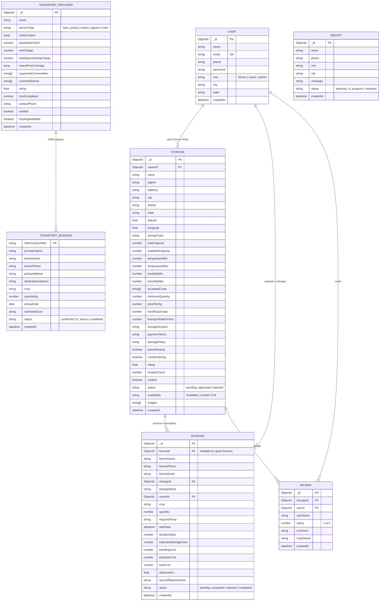

# AgriCold Connect — Complete Entity Relationship Diagram (ERD) & Database Schema

## 1. High-Level Entity Overview

AgriCold Connect is built on a scalable document-oriented data model in MongoDB (hosted on MongoDB Atlas). Below is the comprehensive entity relationship specification and relationship cardinalities.

---

## 2. Detailed Schema Definitions

### 2.1 Collection: `users`
| Field | Type | Required | Unique | Description |
|---|---|---|---|---|
| `_id` | ObjectId | Yes | Yes | MongoDB Primary Key |
| `name` | String | Yes | No | Full name of Farmer, Facility Owner, or Admin |
| `email` | String | Yes | Yes | Unique login email (e.g. `admin@agricold.in`) |
| `phone` | String | Yes | No | Contact telephone/WhatsApp number |
| `password` | String | Yes | No | Bcrypt salted hash (Cost factor 10) |
| `role` | String | Yes | No | Enum: `['farmer', 'owner', 'admin']` (Default: `farmer`) |
| `city` | String | No | No | Operating town/district (e.g., `Sanand`, `Anand`) |
| `state` | String | No | No | State (Default: `Gujarat`) |
| `createdAt` | Date | Auto | No | Document creation timestamp |

### 2.2 Collection: `storages`
| Field | Type | Required | Description |
|---|---|---|---|
| `_id` | ObjectId | Yes | Storage facility unique identifier |
| `ownerId` | ObjectId (Ref: User) | Yes | Reference to facility owner account |
| `name` | String | Yes | Commercial cold warehouse name |
| `tagline` | String | No | Facility feature subtitle |
| `address` | String | Yes | Physical highway / GIDC address |
| `city` | String | Yes | City or Taluka |
| `district` | String | Yes | Gujarat District (e.g., Ahmedabad, Anand, Kheda) |
| `latitude` / `longitude` | Number | Yes | Geographical coordinates for distance calculation |
| `totalCapacity` | Number | Yes | Total capacity in Kilograms (e.g. 5,000,000 kg / 5,000 MT) |
| `availableCapacity` | Number | Yes | Currently unreserved capacity in kg |
| `temperatureMin` | Number | Yes | Lowest cooling setpoint in °C |
| `temperatureMax` | Number | Yes | Highest cooling setpoint in °C |
| `acceptedCrops` | Array[String] | Yes | Supported crops (e.g. `['Potato', 'Tomato', 'Onion']`) |
| `pricePerKg` | Number | Yes | Cold storage rate (₹ per kg per month) |
| `handlingCharge` | Number | Yes | Unloading & crate handling fee (₹ per ton) |
| `transportRatePerKm` | Number | Yes | Estimated freight charge (₹ per km) |
| `powerBackup` | Boolean | Yes | Auxiliary DG Generator status (APEDA compliance) |
| `verified` | Boolean | Yes | Admin physical verification badge |
| `status` | String | Yes | Enum: `['pending', 'approved', 'rejected']` |

### 2.3 Collection: `bookings`
| Field | Type | Required | Description |
|---|---|---|---|
| `_id` | ObjectId | Yes | Unique reservation identifier |
| `farmerName` | String | Yes | Farmer contact name (No account required) |
| `farmerPhone` | String | Yes | Direct callback number for delivery bay booking |
| `storageId` | ObjectId (Ref: Storage) | Yes | Target cold storage facility |
| `ownerId` | ObjectId (Ref: User) | Yes | Target facility owner recipient |
| `crop` | String | Yes | Crop name (Potato, Tomato, Wheat, etc.) |
| `quantity` | Number | Yes | Harvest weight in kilograms |
| `requiredTemp` | String | Yes | Desired chamber temperature range |
| `startDate` | Date | Yes | Proposed arrival date |
| `durationDays` | Number | Yes | Planned storage duration |
| `estimatedStorageCost` | Number | Yes | Calculated chamber rent outlay |
| `handlingCost` | Number | Yes | Loading / unloading labor outlay |
| `transportCost` | Number | Yes | Road freight haulage outlay |
| `totalCost` | Number | Yes | Transparent all-in total estimate |
| `status` | String | Yes | `['pending', 'accepted', 'rejected', 'completed']` |

### 2.4 Collection: `transportproviders`
| Field | Type | Description |
|---|---|---|
| `_id` | ObjectId | Unique logistics carrier ID |
| `name` | String | Transport agency / fleet company name |
| `serviceType` | String | `['farm_pickup', 'export_logistics', 'both']` |
| `vehicleTypes` | Array | Objects containing `{ type, capacityKg, tempControlled, tempMin, tempMax }` |
| `baseRatePerKm` | Number | Base transport rate per kilometer (₹) |
| `minCharge` | Number | Minimum base trip charge (₹) |
| `loadingUnloadingCharge` | Number | Labor handling fee per ton (₹) |
| `exportPortCoverage` | Array | Objects: `{ portName, distanceFromHubKm, transitHours, exportCustomClearanceAssistance, phytosanitarySupport }` |
| `rating` | Number | Driver / fleet performance score (e.g., 4.9/5) |
| `verified` | Boolean | Verified carrier status badge |

---

## 3. Key Relationships & Integrity Rules
1. **Zero-Friction Farmer Access**: The `bookings` collection maintains `farmerName` and `farmerPhone` independently so farmers can book without creating a persistent login session.
2. **Owner-Facility Cascade**: Each cold storage facility belongs to exactly one `ownerId`.
3. **Smart Matching Indexing**: Geospatial and temperature index structures enable `O(log N)` spatial queries on coordinates, temperature compatibility, and crop availability.