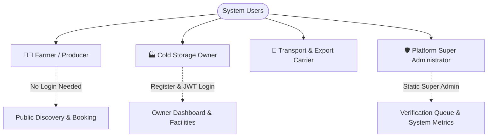
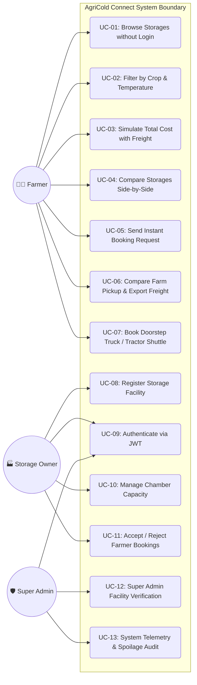

# AgriCold Connect — System Use Cases & Functional Specification

## 1. Actor Hierarchy & System Roles

| Actor | Authentication Requirement | Key Responsibilities |
|---|---|---|
| **Farmer** | **None** (100% Free & Open Access) | Search, compare facilities, run cost calculator, request booking, compare transport/export deals |
| **Storage Owner** | **JWT Authentication** (Register & Login) | Register facilities, manage chamber capacity, approve/reject farmer bookings |
| **Admin** | **Static Admin Credentials** (`admin@agricold.in`) | Verify cold storage facilities, inspect compliance, view platform telemetry |

---

## 2. Use Case Diagrams

### 2.1 Complete System Use Case Diagram

---

## 3. Detailed Use Case Specifications

### Use Case UC-01: Browse & Filter Available Cold Storages
- **Primary Actor**: Farmer
- **Preconditions**: Internet connection; web browser loaded at `/` or `/storages`.
- **Main Success Scenario**:
  1. Farmer enters crop name (e.g. Tomato), quantity (500 kg), location (Sanand), and expected duration (30 days).
  2. System queries active approved facilities in the MongoDB database matching crop compatibility and available capacity.
  3. System computes the **Smart Match Score (0–100%)** considering temperature tolerance, remaining capacity, price, and distance.
  4. Facilities are rendered with live capacity meters, per-kg rates, and APEDA insurance badges.
- **Postconditions**: Farmer views transparent storage choices with zero signup barriers.

---

### Use Case UC-03: Total Cost Simulation (Transparent Outlay)
- **Primary Actor**: Farmer
- **Trigger**: Farmer clicks "Calculate Total Cost" or modifies sliders on a facility card.
- **Business Logic**:
  $$\text{Total Outlay} = (\text{Quantity} \times \text{Rate/kg/month} \times \text{Months}) + \text{Handling Fee} + (\text{Distance} \times \text{Freight/km})$$
- **Expected Outcome**:
  - Itemized breakdown eliminates hidden mandi charges, loading surprises, and toll surcharges upfront.

---

### Use Case UC-06: Farm Pickup & Export Logistics Comparison
- **Primary Actor**: Farmer / Exporter
- **Preconditions**: Harvest yield ready for transportation to cold storage, mandi, or sea port.
- **Main Success Scenario**:
  1. Farmer navigates to `/transport`.
  2. Selects service scope: *All Deals*, *Farm Pickup*, or *Export Port Haulage*.
  3. Selects commodity (e.g., Rice, Wheat, Tomato), weight, and target destination (e.g., Mundra Port).
  4. System fetches verified logistics carriers and displays comparative quotes ranked from lowest total cost.
  5. Displays highlight badges for **Cheapest Verified Quote** and **Fastest Transit Time**.
  6. Farmer selects a carrier and submits a pickup request with zero advance payment.
- **Postconditions**: Carrier receives dispatch alert; driver contacts farmer with gate arrival schedule.

---

### Use Case UC-08 & UC-09: Storage Owner Registration & Management
- **Primary Actor**: Cold Storage Owner
- **Preconditions**: Commercial cold storage facility operator.
- **Main Success Scenario**:
  1. Owner clicks "Storage Owner Portal" on the navbar (`/auth?role=owner`).
  2. Submits facility details: facility name, address, temperature range, capacity, price, and accepted crops.
  3. System creates a secure account with Bcrypt password hashing and issues a signed JSON Web Token (JWT).
  4. Owner enters the **Owner Dashboard** to monitor real-time utilization dials, capacity gauges, and incoming farmer reservations.
  5. Owner clicks "Accept" or "Reject" on booking requests.
- **Postconditions**: Real-time status update propagates to the platform.

---

### Use Case UC-12: Super Admin Verification & Audit
- **Primary Actor**: Platform Administrator
- **Credentials**: `admin@agricold.in` / `Admin@123`
- **Main Success Scenario**:
  1. Admin logs into the Admin Portal (`/admin`).
  2. Inspects facilities submitted with status `pending`.
  3. Reviews generator backup compliance, fire safety, and APEDA insurance certificates.
  4. Approves or denies facility listing.
- **Postconditions**: Approved facilities immediately become discoverable to all Gujarat farmers.